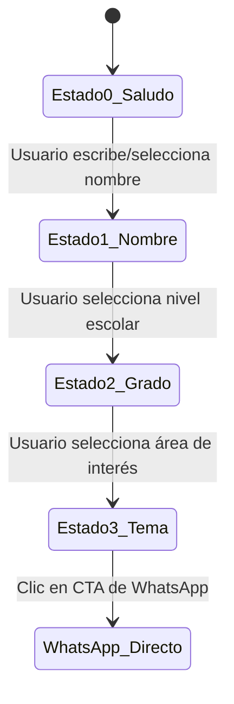

# Especificación de Diseño: Asesor Virtual Híbrido para Colegio ECAN

Este documento define el diseño, comportamiento, flujos de conversación e integraciones para el nuevo **Asesor Virtual Híbrido** en el sitio web de la Escuela Cristiana ECAN.

---

## 1. Objetivos del Proyecto
* **Humanizar la interacción:** Reemplazar el bot rígido por un flujo conversacional cálido, imitando la comunicación con una persona del equipo administrativo (Lic. Sofía Martínez).
* **Guiar al prospecto (Lead Nurturing):** Obtener información básica de contacto (nombre del padre, nivel educativo de interés) de forma interactiva y natural.
* **Maximizar conversiones:** Facilitar la transición de la web a una conversación directa y personalizada en WhatsApp pre-llenando la información recopilada.

---

## 2. Diseño de la Interfaz (UI/UX)
* **Avatar Dinámico:** Mostrará la foto y cargo de la asesora académica. Tendrá un indicador circular verde que pulsa sutilmente (`ping` de CSS) para señalar disponibilidad.
* **Burbujas de Diálogo:**
  * **Bot:** Burbujas translúcidas con fondo difuminado y bordes finos.
  * **Usuario:** Color de acento de la institución con tipografía legible y contraste optimizado.
* **Chips de Sugerencias (Quick Replies):**
  * Ubicados dinámicamente sobre la barra de entrada de texto.
  * Estilo *glassmorphism* animado con escala suave (`whileHover={{ scale: 1.05 }}`) para invitar a hacer clic.
* **Botón CTA de WhatsApp:**
  * Se renderiza dentro del historial como un bloque premium interactivo.
  * Color verde WhatsApp (`#25D366`) con gradiente y efecto de brillo constante (CSS shine effect).

---

## 3. Lógica del Flujo de Conversación (Árbol de Estados)

La lógica controlará el estado del diálogo en una variable reactiva (`chatState`):



### Detalle de los Estados

#### **Estado 0: Saludo Inicial e Identificación**
* **Mensaje del Bot:** *"¡Hola! Qué alegría saludarte. Soy la Lic. Sofía Martínez, encargada de admisiones del Colegio ECAN. 🎓 Me encantaría guiarte personalmente. ¿Con quién tengo el gusto de hablar?"*
* **Entrada de Texto:** Habilitada para escribir el nombre.
* **Sugerencias:** Ninguna (se espera que el usuario escriba su nombre).

#### **Estado 1: Selección del Nivel Académico**
* **Mensaje del Bot:** *"Un gusto saludarte, **{nombre_padre}**. Para orientarte mejor, ¿en qué nivel académico o servicio estás interesado para tu hijo/a?"*
* **Sugerencias (Chips):**
  * `🧩 Inicial y Primaria (Montessori)`
  * `🤖 Secundaria (STEM & Robótica)`
  * `🎨 Talleres Extracurriculares`
  * `❓ Otro / Consultas Generales`

#### **Estado 2: Selección del Tema de Consulta**
* **Mensaje del Bot:** *"¡Excelente elección! En el nivel de **{nivel_seleccionado}** nos enfocamos en el crecimiento integral. ¿Qué te gustaría consultar hoy sobre este nivel?"*
* **Sugerencias (Chips):**
  * `📋 Requisitos de Admisión`
  * `💰 Costos y Matrícula`
  * `📍 Ubicación y Horarios`
  * `💬 Hablar con Asesor Real`

#### **Estado 3: Respuesta Detallada y Acción de Conversión**
* Dependiendo de la selección del usuario:
  * **Admisión:** Explica los 3 pasos (secretaría, diagnóstico, matrícula) y ofrece agendar la cita.
  * **Costos:** Explica la disponibilidad de becas/aranceles y le sugiere recibir la hoja informativa por WhatsApp.
  * **Ubicación:** Detalla dirección, teléfono y horarios en San Salvador.
* **Mensaje del Bot final:** *"Para agilizar tu proceso y darte una atención 100% personalizada, he preparado tus datos. Haz clic en el botón de abajo para que chateemos directamente en mi WhatsApp personal."*
* **Acción Principal:** Renderizar un botón grande que dice: **"💬 Chatear con Sofía en WhatsApp"**.

---

## 4. Integración y Generación del Link de WhatsApp

Al hacer clic en el botón de WhatsApp, se generará una URL dinámicamente que redirigirá a la aplicación:

### URL Base
`https://wa.me/50375151797?text={mensaje_codificado}`

### Lógica de Construcción del Mensaje
```typescript
const phone = "50375151797";
const greeting = `Hola Lic. Sofía, mi nombre es ${parentName}.`;
const details = `Estoy interesado/a en recibir información personalizada sobre ${levelSelected} para mi hijo/a (específicamente sobre ${topicSelected}).`;
const ending = `Vengo de interactuar con el asistente virtual de la web del Colegio ECAN.`;

const fullMessage = `${greeting} ${details} ${ending}`;
const encodedMessage = encodeURIComponent(fullMessage);
const whatsappUrl = `https://wa.me/${phone}?text=${encodedMessage}`;
```

---

## 5. Plan de Verificación y Pruebas

### Pruebas de Flujo
1. **Flujo Feliz:** Iniciar chat, dar nombre "Carlos", seleccionar "Inicial y Primaria", seleccionar "Costos y Matrícula", hacer clic en el botón de WhatsApp y verificar que el texto del enlace esté correctamente codificado y contenga la información dada.
2. **Entrada de Texto Libre:** Escribir preguntas abiertas en cualquier estado y comprobar que la lógica de mitigación responda con amabilidad orientando al usuario a elegir entre hablar con el asesor o regresar al flujo guiado.
3. **Persistencia de Estado:** Cerrar y abrir el widget de chat y comprobar que se mantiene el historial o se reinicia adecuadamente según la experiencia de usuario esperada.

### Pruebas Visuales y de Accesibilidad (A11y)
* Comprobar que los chips de sugerencia tengan suficiente contraste en modo claro y modo oscuro.
* Asegurar que todos los botones e inputs tengan etiquetas `aria-label` para lectores de pantalla.
* Validar que la interfaz sea responsiva en dispositivos móviles (iPhone SE/Pro, tablets).
